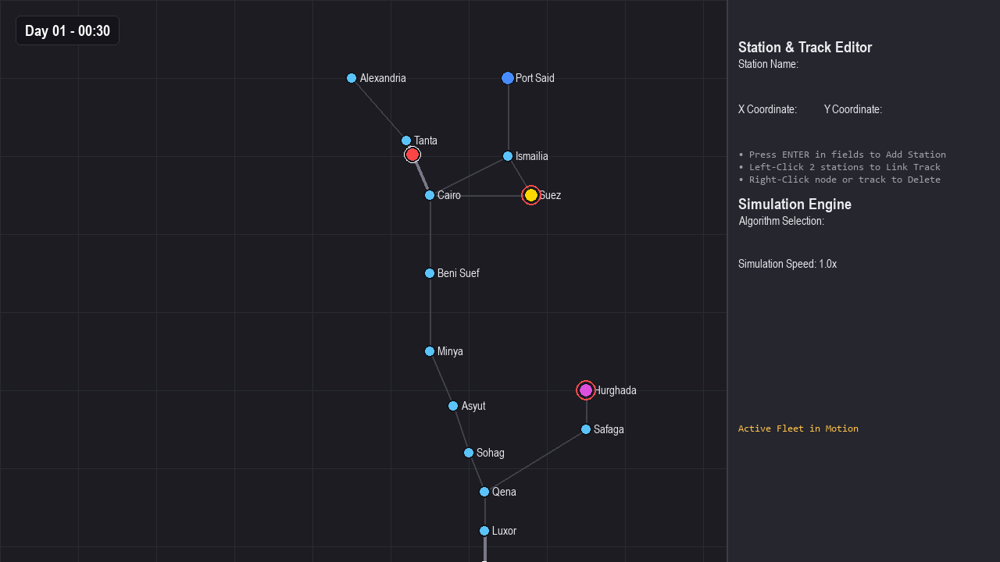
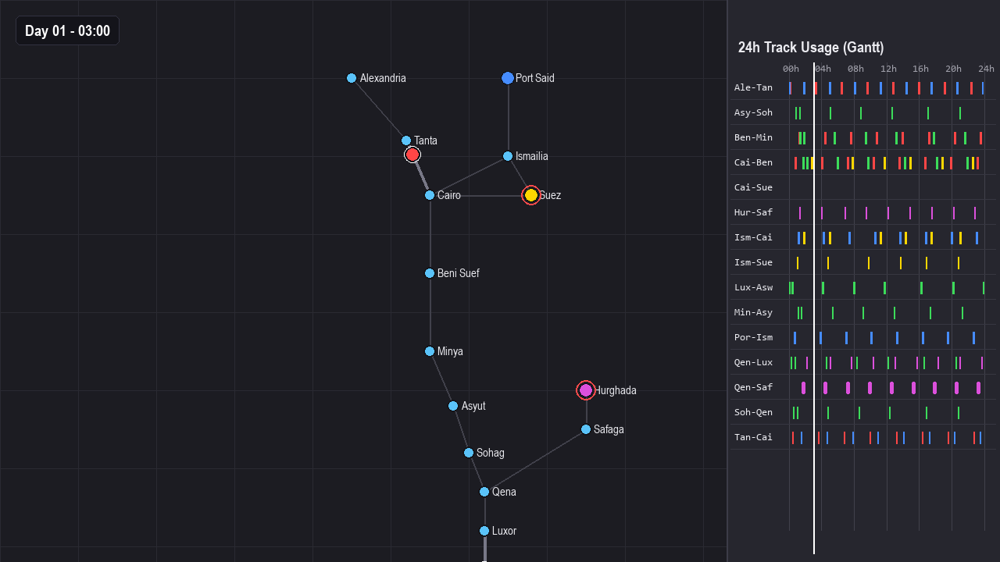
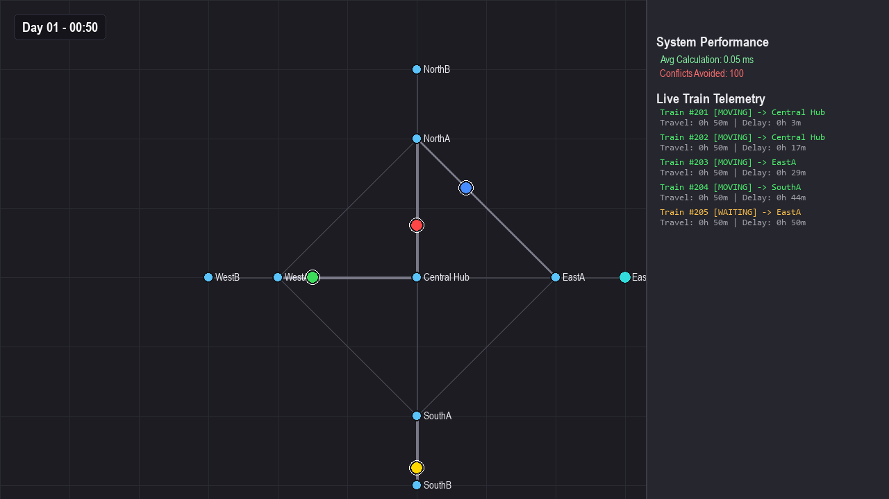
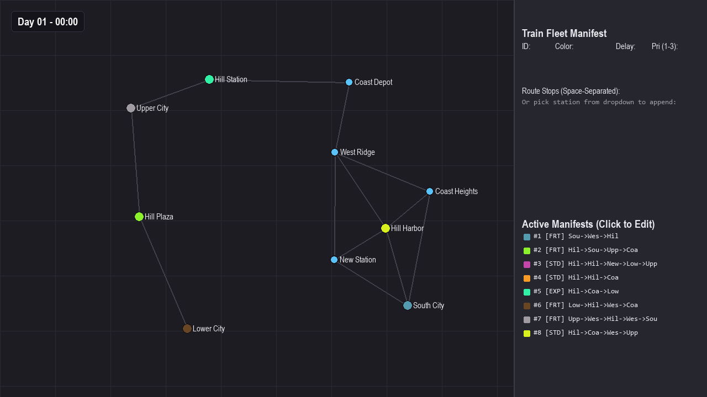

# Smart Rail: Multi-Train AI Scheduling & Conflict Resolution Simulator

[](https://www.python.org/)
[](https://www.pygame.org/)
[](https://networkx.org/)
[](#codebase-package-blueprint)
[](docs/Smart_Rail_Technical_Report.pdf)
[](LICENSE)

An interactive, multi-agent railway simulation, network topology designer, and AI-driven conflict resolution engine built with Python, Pygame, and NetworkX.

---

## 📸 Application in Action

| Egypt National Rail Simulation | 24-Hour Track Occupancy Gantt Chart |
| :---: | :---: |
|  |  |
| *Real-time fleet simulation with dynamic status indicators* | *Spatial-temporal track block reservation timeline* |

| Central Hub Benchmark (Live Stats) | Procedural Random Map Generator |
| :---: | :---: |
|  |  |
| *Radial spoke-hub topology & live latency metrics* | *Procedural Prim's MST network with generated fleet* |

---

## 🚆 Overview

**Smart Rail** models complex railway network topologies and dynamically schedules multiple autonomous train agents across shared single-track sections. Using spatial-temporal reservation tables, the simulator prevents head-on and rear-end collisions while minimizing aggregate delays through dedicated pathfinding and deconfliction algorithms.

---

## ✨ Key Features

- **Data-Driven Architecture:**
  - **Zero Hardcoded Values:** All colors, layout dimensions, simulation speed multipliers, safety headways, and typography reside in [`data/config.json`](data/config.json).
  - **JSON Map Engine:** All maps are stored in `data/maps/*.json`. Dropping any new JSON map into the directory instantly makes it available in the simulator.
  - **Custom Map Exporter:** Author custom stations and tracks in the visual editor and save them directly to a JSON map file from the UI.
- **Dedicated Algorithmic Suite (Individual Modular Solvers):**
  - **Pathfinding:**
    - `BFS`: Unweighted minimum-hop routing ([`algorithms/bfs.py`](algorithms/bfs.py)).
    - `DFS`: Deep path exploration ([`algorithms/dfs.py`](algorithms/dfs.py)).
    - `Dijkstra`: Time-weighted optimal shortest paths ([`algorithms/dijkstra.py`](algorithms/dijkstra.py)).
    - `Floyd-Warshall`: All-pairs shortest paths query matrix ([`algorithms/floyd_warshall.py`](algorithms/floyd_warshall.py)).
  - **Deconfliction & Scheduling:**
    - `CSP / CNF`: Constraint satisfaction disjunctive headway clauses ([`algorithms/cnf_csp.py`](algorithms/cnf_csp.py)).
    - `Greedy`: Incremental earliest-available reservation with step backoff ([`algorithms/greedy.py`](algorithms/greedy.py)).
    - `Priority EDF`: Tiered preemption for Express, Standard, and Freight trains ([`algorithms/priority_edf.py`](algorithms/priority_edf.py)).
    - `Dynamic Reroute`: K-shortest paths alternative corridor load-balancing ([`algorithms/dynamic_reroute.py`](algorithms/dynamic_reroute.py)).
- **Procedural Random Map Generator:**
  - Generates guaranteed-connected railway graphs using Prim's MST with alternative cross-tracks and procedural multi-stop train fleets with assigned priorities (`1=Express`, `2=Standard`, `3=Freight`).
- **24-Hour Gantt Chart (Track Usage Table):**
  - High-performance cached visualization of track occupancy across a 24-hour cycle (`1440` simulation minutes) with seamless day-boundary wrapping.
- **Structured Logging & Graceful Error Recovery:**
  - Rotating file logger (`smart_rail.log`) capturing system events, exceptions, and diagnostics.
  - Automatic fallback defaults on corrupted JSON files without crashing.

---

## 🏛️ Codebase Package Blueprint

```
ai project/
├── data/
│   ├── config.json               # Centralized data-driven configuration
│   └── maps/                     # JSON scenario maps (Egypt, Hub, London, Empty)
├── core/
│   ├── config_manager.py         # JSON config loader, validator & fallback recovery
│   ├── logger.py                 # Structured rotating logger (smart_rail.log)
│   ├── models.py                 # RailwayGraph, TrainAgent, RouteConfig, ScheduleEvent
│   ├── scenario_manager.py       # JSON map loader, dynamic scanner & map exporter
│   └── simulation_engine.py      # Discrete tick loop, multi-agent stepping & metrics
├── algorithms/
│   ├── base.py                   # Base interface & spatial-temporal reservation table
│   ├── bfs.py                    # Breadth-First Search (minimum station hops)
│   ├── dfs.py                    # Depth-First Search (deep route exploration)
│   ├── dijkstra.py               # Dijkstra shortest path (time-optimal)
│   ├── floyd_warshall.py         # Floyd-Warshall all-pairs shortest path matrix
│   ├── cnf_csp.py                # Constraint Satisfaction Problem (CSP / CNF lookahead)
│   ├── greedy.py                 # Greedy earliest-available reservation with step backoff
│   ├── priority_edf.py           # Priority Earliest Deadline First (Express vs Freight)
│   └── dynamic_reroute.py        # Dynamic k-shortest paths alternative corridor deconfliction
├── generators/
│   └── map_generator.py          # Procedural MST-based random railway graph & fleet generator
├── ui/
│   ├── ui_widgets.py             # Pygame-GUI widget hierarchy, inputs & color selectors
│   ├── ui_views.py               # Rendering pipeline (map, grid, HUD, tabs, 24h Gantt chart)
│   └── event_handler.py          # Mouse canvas interactions (linking, deleting, panning)
├── docs/                         # Dedicated documentation directory
│   ├── Smart_Rail_Technical_Report.pdf # Publication-grade academic & technical report PDF
│   ├── code_wiki.md              # Architectural single source of truth
│   ├── project_plan.md           # High-level architecture and scope
│   ├── dev_rules.md              # Development safety baseline (<400 lines rule)
│   ├── functions.md              # Auto-generated API catalog
│   ├── manual_tests.csv          # Quality assurance test matrix
│   └── screenshots/              # Visual demonstration captures
├── scripts/
│   ├── parse_functions.py        # AST docstring parser regenerating functions.md
│   ├── capture_screenshots.py    # Headless screenshot rendering pipeline
│   └── generate_pdf_report.py    # ReportLab academic PDF report generator
├── main.py                       # Top-level application controller (< 350 lines)
├── test_suite.py                 # 6 automated unit & integration test suites
└── requirements.txt              # Package dependencies
```

---

## 🚀 Quickstart & Installation

### 1. Prerequisites
- Python 3.9 or higher.

### 2. Setup Environment
```bash
git clone https://github.com/your-username/smart-rail.git
cd smart-rail

# Install dependencies
pip install -r requirements.txt
```

### 3. Launch Simulator
```bash
python main.py
```

### 4. Run Test Suite
```bash
python test_suite.py
```

---

## 🎮 Controls & User Guide

| Action | Control / Interaction |
| :--- | :--- |
| **Pan Map** | Left-Click and Drag on map canvas |
| **Zoom In / Out** | `+` and `-` buttons on bottom-left |
| **Select / Link Stations** | Left-Click first station, then Left-Click second station |
| **Delete Station / Track** | Right-Click directly on a station node or track line |
| **Add Station** | Enter Name, X, Y in **CONFIG** tab and press <kbd>Enter</kbd> |
| **Cycle Maps** | Click **MAP** button in **CONFIG** tab to cycle JSON scenarios |
| **Generate Random Map** | Click **GENERATE RANDOM MAP** in **CONFIG** tab |
| **Save Custom Map** | Click **SAVE MAP JSON** in **CONFIG** tab |
| **Cycle Algorithms** | Click **ALGO** button in **CONFIG** tab (`CSP`, `GREEDY`, `PRIORITY_EDF`, `DYNAMIC_REROUTE`) |
| **Add / Update Train** | Configure ID, Color, Start Delay, Priority (1-3), and Stops in **SCHED** tab, then click **ADD / UPDATE TRAIN** |
| **Start / Stop Simulation** | Click **START SIMULATION** / **STOP SIMULATION** |
| **Scroll Gantt Chart** | Mouse Wheel Up/Down while **TABLE** tab is active |

---

## 📚 Technical Report & Academic Documentation

A formal, publication-grade technical report is available in [`docs/Smart_Rail_Technical_Report.pdf`](docs/Smart_Rail_Technical_Report.pdf).

To regenerate the documentation and PDF report at any time:
```bash
# Regenerate API catalog (functions.md)
python scripts/parse_functions.py

# Re-capture simulation screenshots
python scripts/capture_screenshots.py

# Recompile PDF report
python scripts/generate_pdf_report.py
```

---

## 📄 License
Distributed under the MIT License. See `LICENSE` for details.
