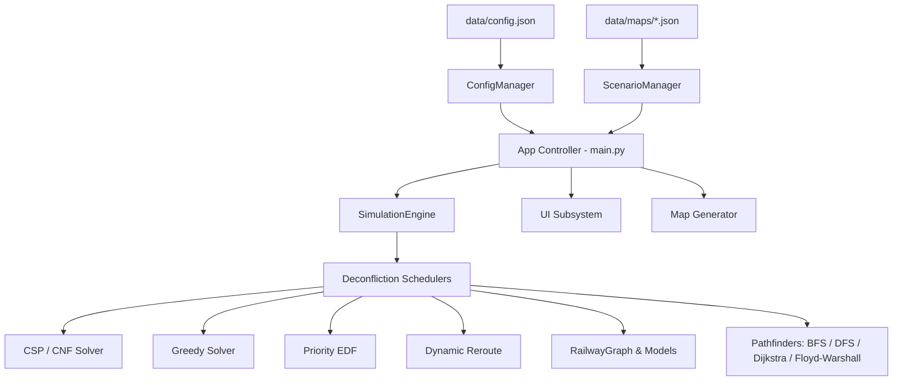

# Smart Rail: Multi-Train AI Scheduling & Conflict Resolution Simulator

## 1. Project Overview & Ultimate Goal
**Smart Rail** is an interactive multi-agent railway simulation, network topology designer, and AI-driven conflict resolution system built with Python, Pygame, and NetworkX. The system models complex planar railway networks, schedules train fleets across single-track segments without head-on or rear-end collisions, and minimizes aggregate system delay using graph algorithms and constraint solvers.

---

## 2. Scope & Target Capabilities

### A. Graph Topology & Pathfinding Engine
- Arbitrary planar railway networks represented as undirected weighted graphs.
- Real-world and benchmark topologies (Egypt, Hub, London, Empty, and procedurally generated random networks).
- Pathfinding suite: **BFS** (unweighted fewest hops), **DFS** (deep exploration), **Dijkstra** (time-weighted optimal), and **Floyd-Warshall** (all-pairs shortest paths matrix).

### B. Intelligent Deconfliction Engine
- **Spatial-Temporal Reservation Table:** Block reservations on undirected track segments $(u, v)$ over intervals $[t_1, t_2]$.
- **Greedy Heuristic:** Incremental booking with fixed-step delay backoff upon detecting contention.
- **CSP / CNF Solver:** Disjunctive constraint lookahead evaluating multi-block headway windows.
- **Priority EDF:** Priority-aware dispatching giving Express trains shorter headway buffers over freight trains.
- **Dynamic Alternative Rerouting:** K-shortest paths alternative corridor exploration to bypass track congestion.

### C. Data-Driven Architecture & Persistence
- **Zero Hardcoded Constants:** All colors, window dimensions, simulation physics, headway margins, and typography defined in `data/config.json`.
- **JSON Map System:** All topologies stored in `data/maps/*.json`.
- **Map Authoring & Export:** Live station placing, track linking, and instant JSON map saving from the UI.
- **Procedural Network Generator:** Generates connected random railway graphs using Prim's MST with random cross-links and random train fleets.

---

## 3. High-Level System Architecture

